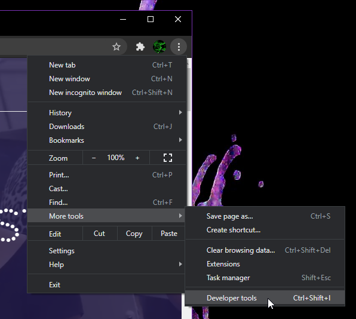

# Cvičení: Úpravy přes vývojářské nástroje / developer tools

1. Vyber si libovolný cizí web.

1. Otevři si pro něj vývojářské nástroje prohlížeče.

   

1. Prozkoumej strukturu stránky.

1. Změn obsah podle vlastního úvážení.

   - Obarvi text.

   - Změň barvu pozadí.

   - Odstraň některé části.

   - Přepiš kusy textu.

   - Změň obrázek.

1. Na závěr udělej přes vývojářské nástroje snímek, obrázek celé stránky a ten si u sebe ulož.
